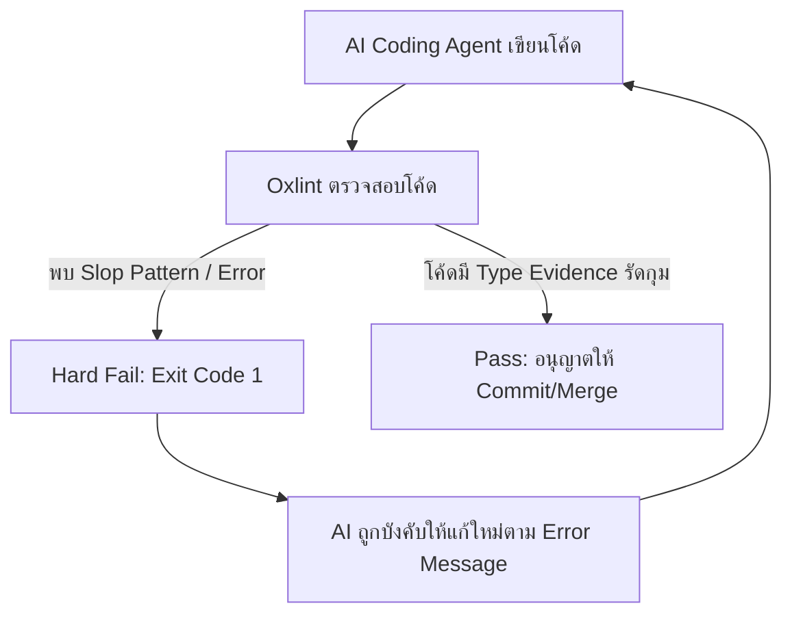

# สรุปองค์ความรู้: Anti-Slop Your Code With This New Linter (Oxlint + anti-slop)

> **ที่มา:** วิดีโอ *Anti-Slop Your Code With This New Linter*  
> **หัวข้อหลัก:** การควบคุมคุณภาพโค้ดที่สร้างโดย AI Coding Agents ด้วย Deterministic Linting Rules (Oxlint + dmmulroy/anti-slop)

---

## 1. บทนำและปัญหา: "AI Code Slop" คืออะไร?

ในยุคที่นักพัฒนาใช้งาน **AI Coding Agents** (เช่น Claude Code, Cursor, Copilot, Cline, Antigravity) ในการเขียนโค้ด ปัญหาที่พบเจอเป็นประจำไม่ใช่เรื่อง AI เขียนโค้ดไม่ทำงาน แต่คือ **"AI Slop"** หรือโค้ดที่ดูเผิน ๆ ภายนอกเหมือนจะใช้งานได้ แต่ภายในเต็มไปด้วยความกำกวม ซ่อนความเปราะบาง และละเมิดระบบความปลอดภัยของ Type System

### ทำไม Prompt หรือ `CLAUDE.md` / `.cursorrules` ถึงเอาไม่อยู่?
1. **Advisory vs. Enforced:** ไฟล์อย่าง `CLAUDE.md` หรือ System Prompt เป็นเพียง *คำแนะนำ (Advisory)* AI อาจปฏิบัติตามในช่วงแรก แต่เมื่อประวัติการสนทนายาวขึ้น (Context Window บวม) หรือเจอปัญหาแก้ยาก AI มักจะ "มองข้าม" กฎเหล่านี้
2. **AI มักจะ "แถประเภท" เพื่อให้คอมไพล์ผ่าน:** เมื่อ AI ติด Type Error มันมักเลือกวิธีที่ง่ายที่สุด เช่น การใส่ `as unknown as Type`, การ Cast Type ดื้อ ๆ, หรือการใช้ `Reflect.get()` เพื่อเลี่ยง Type Checker ส่งผลให้ได้โค้ดที่ขาด **Evidence-based Type Safety**

---

## 2. แนวคิด Deterministic Guardrails (ใช้ Linter เป็น Hard Gate)

ทางออกที่มีประสิทธิภาพที่สุดในการหยุด AI Slop คือการเปลี่ยนจาก **"การขอร้องผ่าน Prompt"** มาเป็น **"Deterministic Guardrail"**



- **Linter มีสถานะเป็น Hard Gate:** ถ้า Linter แจ้งเตือนระดับ `error` กระบวนการ CI/Hook จะล้มเหลวทันที (Exit Code 1)
- **AI Agent จะไม่สามารถ Commit หรือส่งงานได้** จนกว่าจะเขียนโค้ดที่ถูกต้องตามหลัก Type Safety จริง ๆ โดยไม่ใช้ทางลัด

---

## 3. เครื่องมือที่เกี่ยวข้องในระบบนิเวศ (Tools & Tech Stack)

| เครื่องมือ | บทบาทหน้าที่ | จุดเด่นสำคัญ |
|---|---|---|
| **[Oxlint](https://oxc.rs/)** | JavaScript / TypeScript Linter ความเร็วสูง | เขียนด้วย Rust ทำงานเร็วกว่า ESLint 50-100 เท่า เหมาะอย่างยิ่งกับ Workflow ของ AI ที่ต้องการ Feedback ลูปแบบ Real-time |
| **[`anti-slop`](https://github.com/dmmulroy/anti-slop)** | ชุด Custom/Opinionated Lint Rules | ออกแบบมาเฉพาะเพื่อตรวจจับ Low-evidence patterns, Unjustified assertions, และโค้ดสไตล์ AI Slop |
| **Git Hooks (Lefthook / Husky)** | Pre-commit Guardrail | รัน Oxlint ตรวจสอบไฟล์ที่เปลี่ยนแปลงก่อน commit อัตโนมัติ |
| **CI/CD Pipeline (GitHub Actions)** | Final Gatekeeper | รันตรวจสอบขั้นเด็ดขาดก่อน Merge เข้าสู่ Main Branch |

---

## 4. เจาะลึก Slop Patterns และ Anti-Slop Rules

โปรเจกต์ `dmmulroy/anti-slop` มุ่งเน้นการปฏิเสธ Pattern ที่ "ปลอมแปลงความมั่นใจ" (Fabricating Certainty) โดยมีกฎสำคัญดังนี้:

### 1) No Chained / Nested Type Assertions
* **Slop Pattern:** การซ้อน Type Assertion เช่น `value as unknown as TargetType`
* **ปัญหา:** เป็นการปิดปาก TypeScript Compiler โดยสิ้นเชิงเพื่อดันโค้ดให้ผ่าน
* **แนวทางที่ถูกต้อง:** ทำ Type Narrowing, Validation ด้วย Zod/ArkType, หรือใช้ Type Guard Functions

### 2) No Unsafe Type Widening & Re-assertion
* **Slop Pattern:** นำค่าที่มี Type ชัดเจนอยู่แล้วไปแปลงเป็น Type กว้าง ๆ (เช่น `any` หรือ `unknown`) แล้วค่อย Cast กลับมาเป็น Type ปลายทาง
* **ปัญหา:** สูญเสีย Type Information ที่ Compiler มีอยู่เดิมโดยไม่มีเหตุผล

### 3) Restrict `Reflect.get` & `Reflect.apply`
* **Slop Pattern:** ใช้ `Reflect` เพื่อดึง Property หรือเรียก Method ที่ TypeScript บ่นว่าไม่มีอยู่
* **ปัญหา:** เป็นการ Bypass Property Checking ในระดับ Runtime

### 4) No Broad Object / Unsafe Dictionary Types
* **Slop Pattern:** ใช้ `Record<string, any>` หรือ Object Type กว้าง ๆ แทนการประกาศ Interface / Schema ที่ชัดเจน

### 5) No Conditional Empty Object Spreading
* **Slop Pattern:** `const obj = { ...base, ...(condition ? { extra: 1 } : {}) }`
* **ปัญหา:** ส่งผลให้ Type ของ Object กลายเป็น Union ที่ไม่ชัดเจน ควรแยกการกำหนดโครงสร้างให้แน่นอน

### 6) Mandatory Safety Comment for Non-const Assertions
* หากมีความจำเป็นจริง ๆ ที่จะต้องใช้ Type Assertion (ที่ไม่ใช่ `as const`) กฎจะบังคับให้ต้องมี Comment อธิบายเหตุผลความปลอดภัยตามรูปแบบที่กำหนด เพื่อป้องกันไม่ให้ AI หรือ Developer ใส่ Assertion โดยไม่คิด

---

## 5. ปรัชญาการใช้งาน: Vendoring Model

โปรเจกต์ `anti-slop` ออกแบบมาให้ใช้งานแบบ **"Vendoring"** (คัดลอก Rules เข้ามาอยู่ใน Repository ของเราเอง) แทนการ Install เป็น `npm package` สำเร็จรูป:

- **เหตุผล:** ทีมแต่ละทีมและโปรเจกต์แต่ละแบบมีระดับความเข้มงวดของ Type System ที่ต่างกัน
- **ข้อดี:**
  1. สามารถปรับแต่ง เปิด/ปิด หรือแก้ไขเงื่อนไขของแต่ละ Rule ให้เข้ากับวัฒนธรรมของทีมได้ทันที
  2. ไม่ต้องผูกติดกับ Dependency ภายนอกที่อาจมี Breaking Change
  3. AI Agent ในทีมสามารถอ่าน Rule Source Code ใน Repo เพื่อทำความเข้าใจบริบทได้ดียิ่งขึ้น

---

## 6. แนวทางการติดตั้งและนำไปใช้งาน (Implementation Steps)

### ขั้นตอนที่ 1: ติดตั้ง Oxlint
```bash
npm install -D oxlint
# หรือ
pnpm add -D oxlint
# หรือ
bun add -d oxlint
```

### ขั้นตอนที่ 2: ติดตั้ง Anti-Slop Rules (ผ่าน Agent Skill หรือ Manual)
สามารถใช้ Skill CLI ในการดึง Rule เข้ามาในโปรเจกต์:
```bash
npx skills add dmmulroy/anti-slop --skill install-anti-slop
```
หรือคัดลอก Rule จากโฟลเดอร์ `src/` ของ `dmmulroy/anti-slop` มาไว้ในโปรเจกต์ของคุณโดยตรง

### ขั้นตอนที่ 3: ตั้งค่า `oxlint.json`
เปิดใช้งาน Ruleset ในระดับ `error` เพื่อให้กระบวนการตรวจสอบเป็นแบบ Hard Fail:
```json
{
  "$schema": "./node_modules/oxlint/configuration_schema.json",
  "plugins": ["typescript", "unicorn", "oxc"],
  "rules": {
    "no-explicit-any": "error"
  }
}
```

### ขั้นตอนที่ 4: ผูกเข้ากับ Pre-commit Hook (เช่น Lefthook / Husky)
สร้างคำสั่งใน `package.json`:
```json
{
  "scripts": {
    "lint:slop": "oxlint --deny-warnings",
    "lint": "oxlint"
  }
}
```

---

## 7. สรุปภาพรวม (Key Takeaways)

1. **อย่าพึ่งพาแค่ Prompt เพื่อคุณภาพโค้ด:** AI จะละเลยกฎใน Markdown เมื่อ Context ยาวขึ้น
2. **ใช้ Linter ความเร็วสูง (Oxlint) เป็น Hard Gate:** เพราะ Rust-based Linter ทำงานได้เร็วระดับมิลลิวินาที ทำให้ Agent ตรวจสอบและแก้ไขตัวเองได้ทันทีใน Feedback Loop
3. **บังคับใช้ Type Evidence:** โค้ดที่ดีต้องมีหลักฐานยืนยันความถูกต้องผ่าน Type System ไม่ใช่การ Cast หรือ Bypass ปัญหา
4. **Vendor & Customize:** นำชุดกฎมาปรับใช้และคัดเลือกเฉพาะข้อที่เหมาะกับทีมเพื่อความยั่งยืนของ Codebase
