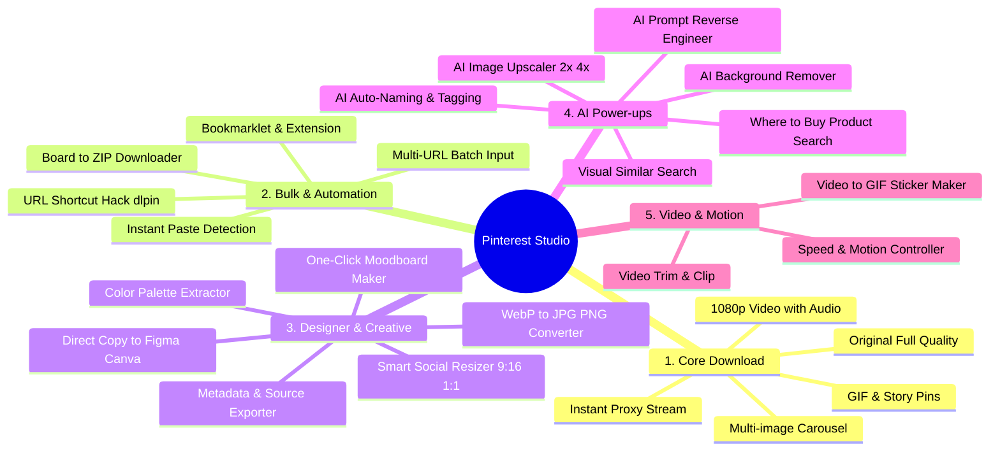

# 📌 Pinterest Media Studio: เอกสารสรุปฟีเจอร์และสเปกฉบับสมบูรณ์ (Master Feature Specification)

> **เป้าหมาย:** รวบรวมฟีเจอร์ทั้งหมด ทั้ง **"ชุดเริ่มต้น (Core Features)"** และ **"ชุดไม้ตายขั้นสูง (Killer & AI Features)"** ไว้อย่างครบถ้วน 100% ไม่มีตกหล่น พร้อมสถาปัตยกรรมการพัฒนา

---

## 📑 สารบัญหมวดหมู่ฟีเจอร์ทั้งหมด (รวมทั้งของเก่า + ของใหม่)

---

## 📋 รายละเอียดฟีเจอร์ทั้งหมด (All Features Breakdown)

### หมวดที่ 1: ระบบดาวน์โหลดพื้นฐานและคุณภาพสื่อ (Core Media Extraction)
1. **Original Quality Image Extractor (ดึงภาพต้นฉบับแท้):** แปลง URL ย่อขนาด (`236x`, `564x`, `736x`) ไปดึงภาพขนาดเต็มสูงสุด (`/originals/`)
2. **Full Video & Audio Combiner (วิดีโอ 1080p/720p + เสียงครบ):** ดึงไฟล์วิดีโอความคมชัดสูงสุดพร้อมรวมเสียงในตัว
3. **Carousel / Multi-Image Pin Extractor (อัลบั้มหลายรูป):** ตรวจจับ Pin ที่มีหลายภาพ ให้เลือกดาวน์โหลดรูปเดี่ยว หรือกดโหลดทั้งหมด
4. **GIF & Animated Pins Support:** ดาวน์โหลดภาพเคลื่อนไหวพร้อมเลือกเซฟเป็น `.gif` หรือ `.mp4`
5. **Direct Proxy Streaming (โหลดตรงไม่เด้งแท็บ):** ส่งสัญญาณดาวน์โหลดตรงเข้าเครื่องทันทีผ่าน Browser ไม่เปิดแท็บซ้ำซ้อน

---

### หมวดที่ 2: ระบบดาวน์โหลดเป็นชุดและความสะดวกอัตโนมัติ (Bulk & Automation)
6. **Board Downloader to ZIP (โหลดยกกระดาน):** แปะลิงก์ Pinterest Board แล้วระบบจะดึงทุกภาพมาบีบอัดเป็น `.zip` ให้โหลดในคลิกเดียว
7. **Multi-Link Batch Input:** ช่องใส่ URL ที่รองรับการวางทีละหลายลิงก์ (10–50 ลิงก์) แล้วดาวน์โหลดแบบขนาน
8. **URL Domain Hack Shortcut (สูตรลัดไม่ต้องเข้าเว็บก่อน):** เติมคำว่า `dl` หน้า URL เช่น `dlpinterest.com/pin/12345` แล้วกด Enter เพื่อดาวน์โหลดทันที
9. **Bookmarklet & Browser Extension:** ปุ่มลัดบนแถบ Bookmark กดคลิกเดียวจากหน้า Pinterest ส่งมาโหลดได้ทันที
10. **Instant Clipboard Paste Detection:** ตรวจจับลิงก์ Pinterest จาก Clipboard เมื่อเปิดหน้าเว็บและขึ้นพรีวิวให้อัตโนมัติ

---

### หมวดที่ 3: เครื่องมือสำหรับดีไซเนอร์และครีเอเตอร์ (Designer & Creative Suite)
11. **Color Palette Extractor (🎨 สกัดชุดโค้ดสี):** ดึงโค้ดสี Hex 5–6 สีจากภาพอัตโนมัติ พร้อมปุ่มคลิกเดียว Copy ไปใช้
12. **Format Converter (ตัวแปลงสกุลไฟล์):** แปลงไฟล์จาก `.webp` เป็น `.jpg`, `.png`, หรือ `.pdf` ได้ทันที
13. **One-Click Moodboard Maker (สร้างมู้ดบอร์ดรวมภาพ):** จัดเลย์เอาต์รวมภาพหลาย ๆ รูปเป็นคอลลาจ (Collage Layout) สำหรับส่งงานหรือปริ้นท์
14. **Smart Social Resizer (ปรับสัดส่วนลงโซเชียล):** ปรับขนาดเป็น **9:16 (TikTok/Reels/Story)**, **1:1 (Square)**, หรือ **4:5 (IG Post)** พร้อมระบบ Smart Blur พื้นหลัง
15. **Direct Copy to Figma / Canva:** ปุ่มคัดลอก Data รูปภาพ สามารถสลับไปที่ Figma แล้วกด `Ctrl + V` แปะได้ทันที
16. **Metadata & Source Saver:** บันทึกชื่อ Pin, Description, Tags, และลิงก์เว็บไซต์ต้นทางเป็นไฟล์ `.txt` หรือ `.json`

---

### หมวดที่ 4: พลังปัญญาประดิษฐ์ (AI-Powered Enhancements)
17. **AI Background Remover (ไดคัทตัดพื้นหลัง):** ตัดพื้นหลังรูปภาพเป็น PNG โปร่งใส (Transparent) ในคลิกเดียว
18. **AI Image Upscaler (ขยายภาพคมชัด 2x / 4x):** เพิ่มความละเอียดของภาพขนาดเล็กด้วย AI Super-Resolution
19. **AI Prompt Reverse-Engineering (แกะ Prompt ภาพ AI):** สแกนภาพที่สร้างด้วย Midjourney/DALL-E/Stable Diffusion แล้วถอดข้อความ Prompt ออกมาให้
20. **"Where to Buy?" Reverse Product Search:** สแกนวัตถุ/เฟอร์นิเจอร์/เสื้อผ้าในภาพเพื่อค้นหาพิกัดซื้อสินค้าบน Shopee, Lazada, IKEA, Amazon
21. **AI Auto-Naming & Auto-Tagging:** ตั้งชื่อไฟล์อัจฉริยะตามสิ่งที่อยู่ในภาพ (เช่น `modern_living_room_wood.jpg`) แทนตัวเลขสุ่ม
22. **Visual Similar Search:** ปุ่มค้นหาภาพไอเดียอื่น ๆ ที่มี Mood & Tone หรือสไตล์ใกล้เคียงกัน

---

### หมวดที่ 5: การจัดการวิดีโอและภาพเคลื่อนไหว (Video & Motion Tools)
23. **Video Trim & Clip Tool:** เลือกตัดเฉพาะช่วงวินาทีที่ต้องการจากวิดีโอ Pinterest
24. **Video to GIF & Sticker Maker:** แปลงช่วงเวลาวิดีโอสั้นให้กลายเป็น Animated GIF หรือ WebP Sticker สำหรับส่งใน LINE/Telegram
25. **Speed & Playback Controller:** ปรับความเร็ววิดีโอ (Slow-motion / Speed up) ก่อนดาวน์โหลด

---

## 🛠️ ข้อมูลทางเทคนิค (Technical Architecture)

- **ไม่ต้องใช้ GPU ในเครื่อง:** ระบบประมวลผลการดึงข้อมูลและแปลงไฟล์ผ่าน CPU และ Node.js Native Streams ที่เร็วระดับมิลลิวินาที ส่วน AI ประมวลผลผ่าน Serverless Cloud API
- **โครงสร้างโค้ดแบบ Modular:**
  - `src/extractors/`: ตัวแกะลิงก์ (Single Pin, Video, Carousel, Board)
  - `src/processors/`: ตัวแปลงสกุลไฟล์, ดูดโค้ดสี, รวมไฟล์ ZIP
  - `src/server/`: Web UI และ REST API
  - `src/test-runner.ts`: ระบบทดสอบอัตโนมัติ
- **Anti-Slop Quality Gate:** ทุกไฟล์ถูกควบคุมคุณภาพด้วย `Oxlint` และ TypeScript Strict Type Checking 100%
