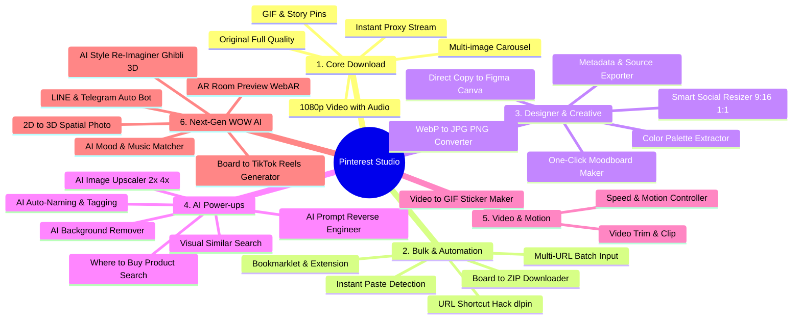

# 📌 Pinterest Media Studio: เอกสารสรุปฟีเจอร์และสเปกฉบับสมบูรณ์ (Master Feature Specification)

> **เป้าหมาย:** รวบรวมฟีเจอร์ทั้งหมด ทั้ง **"ชุดเริ่มต้น (Core Features)"**, **"ชุดไม้ตาย (Creative Suite)"**, และ **"ชุดนวัตกรรมสุดล้ำ (Next-Gen WOW & Spatial AI)"** รวมทั้งสิ้น **31 ฟังก์ชัน**

---

## 📑 สารบัญหมวดหมู่ฟีเจอร์ทั้งหมด (31 ฟังก์ชัน)

---

## 📋 รายละเอียดฟีเจอร์ทั้งหมด (Complete 31 Features Breakdown)

### หมวดที่ 1: ระบบดาวน์โหลดพื้นฐานและคุณภาพสื่อ (Core Media Extraction)
1. **Original Quality Image Extractor:** ดึงภาพขนาดเต็มสูงสุดแท้ของ Pinterest (`originals/`) ที่คมชัดกว่าภาพพรีวิวบนเว็บ
2. **Full Video & Audio Combiner:** ดึงวิดีโอระดับ HD (1080p / 720p) พร้อมรวมเสียงในตัว
3. **Carousel / Multi-Image Pin Support:** ตรวจจับ Pin แบบอัลบั้มหลายรูป ให้เลือกโหลดแยกรูปเดี่ยวหรือโหลดทั้งหมด
4. **GIF & Animated Pins Support:** ดาวน์โหลดภาพเคลื่อนไหวพร้อมเลือกบันทึกเป็น `.gif` หรือ `.mp4`
5. **Direct Proxy Streaming:** ระบบดาวน์โหลดตรงเข้าเครื่องทันทีผ่าน Browser ไม่เปิดแท็บซ้ำซ้อน

---

### หมวดที่ 2: ระบบดาวน์โหลดเป็นชุดและความสะดวกอัตโนมัติ (Bulk & Automation)
6. **Board Downloader to ZIP:** แปะลิงก์ Pinterest Board แล้วระบบจะดึงภาพทุกรูปในบอร์ดมาแพ็กเป็นไฟล์ `.zip` ให้โหลดในคลิกเดียว
7. **Multi-Link Batch Input:** ช่องใส่ URL ที่รองรับการวางทีละ 10–50 ลิงก์พร้อมกันเพื่อดึงข้อมูลแบบคู่ขนาน
8. **URL Domain Hack Shortcut:** สูตรลัดดาวน์โหลด แค่เติมคำว่า `dl` หน้า URL เช่น `dlpinterest.com/pin/...` เพื่อโหลดทันทีโดยไม่ต้องเข้าหน้าเว็บก่อน
9. **Bookmarklet & Extension:** ปุ่มลัดบนแถบ Bookmark กดคลิกเดียวจากหน้า Pinterest ส่งมาดาวน์โหลดได้ทันที
10. **Instant Clipboard Paste Detection:** ตรวจจับลิงก์ Pinterest จาก Clipboard อัตโนมัติเมื่อเปิดหน้าเว็บ

---

### หมวดที่ 3: เครื่องมือสำหรับดีไซเนอร์และครีเอเตอร์ (Designer & Creative Suite)
11. **Color Palette Extractor (🎨 สกัดชุดโค้ดสี):** ดูดชุดสีเด่น 5–6 สี (Hex Codes) จากภาพอัตโนมัติ พร้อมปุ่มคลิกเดียว Copy
12. **Format Converter (ตัวแปลงสกุลไฟล์):** แปลงไฟล์จาก `.webp` เป็น `.jpg`, `.png`, หรือ `.pdf` สำหรับปริ้นท์ได้ทันที
13. **One-Click Moodboard Maker:** นำภาพที่ดึงไว้มาจัดเลย์เอาต์เป็นแผ่น Collage สวยงาม (ขนาด A4, 16:9, หรือ Story) พร้อมส่งลูกค้า
14. **Smart Social Resizer:** ปรับสัดส่วนเป็น **9:16 (TikTok/Reels)**, **1:1 (Post)**, **4:5 (Portrait)** พร้อมระบบ **Smart Blur Background** เบลอขอบเนียน ๆ
15. **Direct Copy to Figma / Canva:** ปุ่มคัดลอก Data รูปภาพ สามารถสลับไปที่ Figma แล้วกด `Ctrl + V` แปะได้ทันที
16. **Metadata & Source Saver:** บันทึกชื่อ Pin, คำอธิบาย, Tags, และลิงก์ต้นทางเป็นไฟล์ `.txt` หรือ `.json`

---

### หมวดที่ 4: พลังปัญญาประดิษฐ์ (AI-Powered Enhancements)
17. **AI Background Remover:** ไดคัทตัดพื้นหลังรูปภาพเป็น PNG โปร่งใส (Transparent) ใน 1 คลิก
18. **AI Image Upscaler (2x / 4x):** ขยายความคมชัดของภาพขนาดเล็กด้วย AI Super-Resolution
19. **AI Prompt Reverse-Engineering:** สแกนภาพที่สร้างด้วย Midjourney/DALL-E แล้วแกะข้อความ Prompt ออกมาให้
20. **"Where to Buy?" Reverse Product Search:** สแกนวัตถุ/เสื้อผ้าในภาพเพื่อค้นหาพิกัดซื้อสินค้าบน Shopee, Lazada, IKEA
21. **AI Auto-Naming & Auto-Tagging:** ตั้งชื่อไฟล์อัจฉริยะตามสิ่งที่อยู่ในภาพ (เช่น `modern_kitchen_interior.jpg`) แทนตัวเลขสุ่ม
22. **Visual Similar Search:** ปุ่มค้นหาภาพไอเดียอื่น ๆ ที่มี Mood & Tone หรือองค์ประกอบใกล้เคียงกัน

---

### หมวดที่ 5: การจัดการวิดีโอและภาพเคลื่อนไหว (Video & Motion Tools)
23. **Video Trim & Clip Tool:** เลือกตัดเฉพาะช่วงวินาทีที่ต้องการจากวิดีโอ Pinterest
24. **Video to GIF & Sticker Maker:** แปลงช่วงเวลาวิดีโอสั้นให้กลายเป็น Animated GIF หรือ WebP Sticker สำหรับส่งใน LINE/Telegram
25. **Speed & Playback Controller:** ปรับความเร็ววิดีโอ (Slow-motion / Fast forward) ก่อนดาวน์โหลด

---

### หมวดที่ 6: นวัตกรรมสุดล้ำแห่งอนาคต (Next-Gen WOW & Spatial AI Suite)
26. **2D to 3D Spatial Photo & Parallax Video Generator:** วิเคราะห์ความลึกของวัตถุ (Depth Map) แปลงภาพ 2D ให้กลายเป็น 3D Parallax Video หรือ Spatial Video สำหรับ **Apple Vision Pro / Meta Quest**
27. **Board to TikTok / Reels Auto-Video Generator:** เลือก 1 บอร์ด แล้วกดปุ่มเดียวให้ AI ตัดต่อเป็นคลิปวิดีโอสั้นแนวตั้ง 9:16 ใส่ทรานซิชันและดนตรี Beat-Sync พร้อมโพสต์ลง TikTok/Reels ใน 5 วินาที
28. **AR Room Preview (WebAR):** สแกนเฟอร์นิเจอร์/ของแต่งบ้านในภาพ แล้วเปิดกล้องมือถือให้ทดลองวางในห้องจริงผ่าน Augmented Reality โดยไม่ต้องลงแอป
29. **AI Mood & Music Matcher:** วิเคราะห์ Mood & Tone ของภาพ แล้วสร้างเพลง BGM ลิขสิทธิ์ฟรี (Royalty-free AI Audio) ที่เข้ากับภาพนั้นให้อัตโนมัติ
30. **AI Style Re-Imaginer:** สั่ง AI แปลงภาพ Pinterest เดิมให้อยู่ในสไตล์ใหม่ เช่น Studio Ghibli Anime, 3D Claymation สไตล์ Pixar, หรือภาพวาดสีน้ำ
31. **LINE & Telegram Auto-Downloader Bot:** แชร์ลิงก์ Pinterest จากมือถือเข้า LINE/Telegram บอทจะตอบกลับด้วยไฟล์ Original HD และ MP4 ในเสี้ยววินาที

---

## 🛠️ ข้อมูลทางเทคนิค (Technical Architecture)

- **ไม่ต้องใช้ GPU ในเครื่อง:** ระบบประมวลผลการดึงข้อมูลและแปลงไฟล์ผ่าน CPU และ Node.js Native Streams ที่เร็วระดับมิลลิวินาที ส่วน AI ประมวลผลผ่าน Serverless Cloud API
- **โครงสร้างโค้ดแบบ Modular:**
  - `src/extractors/`: ตัวแกะลิงก์ (Single Pin, Video, Carousel, Board)
  - `src/processors/`: ตัวแปลงสกุลไฟล์, ดูดโค้ดสี, รวมไฟล์ ZIP
  - `src/server/`: Web UI และ REST API
  - `src/test-runner.ts`: ระบบทดสอบอัตโนมัติ
- **Anti-Slop Quality Gate:** ทุกไฟล์ถูกควบคุมคุณภาพด้วย `Oxlint` และ TypeScript Strict Type Checking 100%
